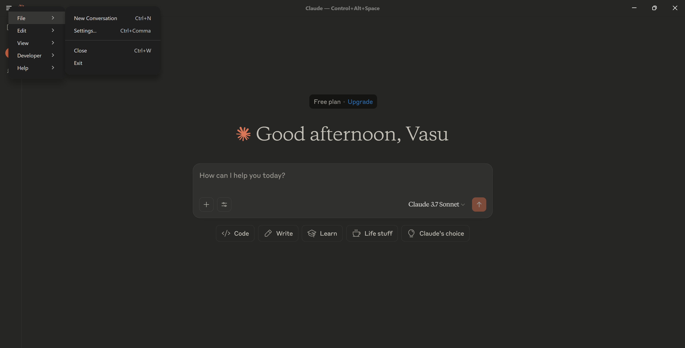
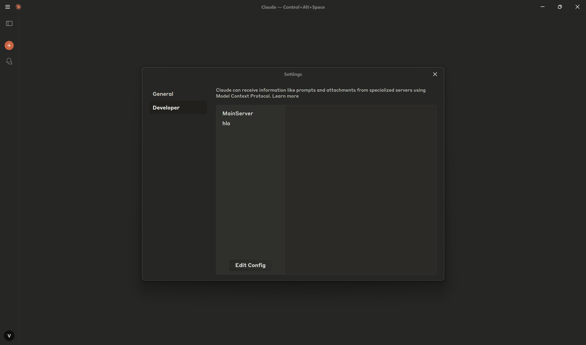
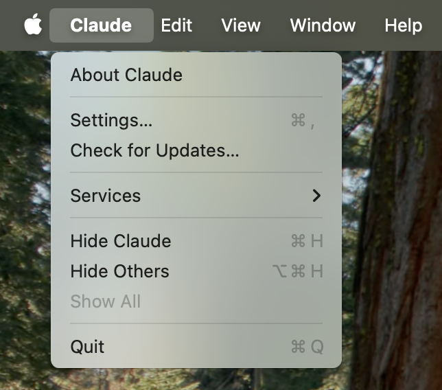

# Reltio MCP Server – Developer Edition

**Reltio MCP Server** is a lightweight, plugin-based **Model Context Protocol (MCP)** server designed to perform advanced entity matching with language models in Reltio environments.

---

## Table of Contents
- [Available Tools](#available-tools)
- [Environment Configuration](#environment-configuration)
- [Server Prerequisites](#server-prerequisites)
- [Client Prerequisites](#client-prerequisites)
- [Running the Server](#running-the-server)
- [Integration with Claude Desktop App](#integration-with-claude-desktop-app)
- [Custom MCP Client Integration](#custom-mcp-client-integration)
- [Testing](#testing)
- [Agent Client](#agent-client)

---

## Available Tools

| Tool Name                        | Description                                  |
|----------------------------------|----------------------------------------------|
| `search_entities_tool`          | Advanced search for entities                 |
| `get_entity_tool`               | Retrieve details of an entity                |
| `update_entity_attributes_tool` | Update an entity attributes                  |
| `get_entity_matches_tool`       | Find matches for a given entity              |
| `get_entity_match_history_tool` | View match history of an entity              |
| `get_relation_tool`             | Retrieve relation details                    |
| `find_matches_by_match_score_tool` | Find matches within a score range         |
| `find_matches_by_confidence_tool` | Find matches by confidence level           |
| `get_total_matches_tool`        | Get total count of potential matches         |
| `get_total_matches_by_entity_type_tool` | Get counts of matches by entity type  |
| `merge_entities_tool`           | Merge two entities                           |
| `reject_entity_match_tool`      | Mark an entity as not a match                |
| `unmerge_entity_by_contributor_tool` | Unmerge a contributor entity keeping profiles under it |
| `unmerge_entity_tree_by_contributor_tool` | Unmerge a contributor entity and all profiles under it |
| `export_merge_tree_tool`        | Export merge tree for all entities of tenant |
| `get_business_configuration_tool` | Business configuration of a tenant         |
| `get_tenant_permissions_metadata_tool`| Tenant permission/security metadata    |
| `get_tenant_metadata_tool`      | Get metadata details for a specific tenant, including schema and type counts. |
| `get_data_model_definition_tool` | Retrieve the full data model definition for a tenant (entity, relation, etc. types). |
| `get_entity_type_definition_tool` | Get the definition for a specific entity type in the tenant. |
| `get_change_request_type_definition_tool` | Get the definition for a specific change request type in the tenant. |
| `get_relation_type_definition_tool` | Get the definition for a specific relation type in the tenant. |
| `get_interaction_type_definition_tool` | Get the definition for a specific interaction type in the tenant. |
| `get_graph_type_definition_tool` | Get the definition for a specific graph type in the tenant. |
| `get_grouping_type_definition_tool` | Get the definition for a specific grouping type in the tenant. |
| `get_merge_activities_tool`     | Retrieve entity merge activity events with flexible filtering |
| `capabilities_tool`             | Lists all available tools                    |

---

## Environment Configuration

Create a `.env` file in the root directory:

```env
RELTIO_SERVER_NAME=RELTIO_MCP_SVR_NAME
RELTIO_ENVIRONMENT=RELTIO_ENVIRONMENT
RELTIO_CLIENT_ID=RELTIO_CLIENT_ID
RELTIO_CLIENT_SECRET=RELTIO_CLIENT_SECRET
RELTIO_TENANT=RELTIO_TENANT
RELTIO_AUTH_SERVER=RELTIO_AUTH_SEVER # Default: https://auth.reltio.com
```

---

## Server Prerequisites

- **Python ≥ 3.10**  
- **(Optional) Docker installed, only if you choose to run the server with Docker - See instructions below**
- **(Optional) uv (python package manager) installed, only if you choose to run the server without Docker - See instructions below**

## Client Prerequisites

If you want to consume the server from Claude AI (Anthropic):
- **Claude Desktop App** installed from [claude.ai](https://claude.ai)  
- **Node.js**

If you want to consume the server from a custom client (OpenAI, Gemini, Anthropic)
- **Go to the section below on Custom MCP Client Integration**

---

## Running the Server

### Option 1: Manual Execution (RECOMMENDED)
Run this script to automate setup (virtualenv, install, Claude config injection):

#### If you are on Windows, open a terminal and run this command:

> ⚠️ Right-click `setup.bat` → **Properties → Unblock** → Run as Admin (if SmartScreen warning appears)

```bash
setup.bat
```

#### If you are on macOS / Linux, open a terminal and run this command:

```bash
bash setup.sh
```

You then might need to activate your newly-created virtual environment if it was not activated in your terminal already

```
source .venv/bin/activate
```

After initial setup (it applies to Windows/macOS/Linux), run this command:

```bash
mcp install --with requests --with pyyaml main.py -f .env 
```

Open Claude (or your custom MCP Client) and start using it.

### Option 2: With Docker

Make sure you have Docker installed (https://www.docker.com/products/docker-desktop/)

Open a terminal and run this command:

```bash
docker compose up -d --build
```

To configure Claude to use this MCP server, please go into the next section.

---

## Integration with Claude Desktop App

>You must follow these steps ONLY if you are running the server with docker (option 2 above). Option 1 does not require this subsequent step.
### Step 1: Launch Claude Desktop

Open the Claude app on your system.

### Step 2: Access Settings

#### If you are on Windows
1. Open **Claude Desktop**.
2. Click the hamburger menu (top-left).
3. Go to: `Settings → Developer → Edit Config`.

  


#### If you are on macOS
1. Open **Claude Desktop**.
2. Click `Claude` from the macOS menu bar.
3. Go to: `Settings → Developer → Edit Config`.



Add this entry to the `claude_desktop_config.json` file:

```json
{
  "mcpServers": {
    "reltio-mcp-server": {
      "command": "npx",
      "args": [
        "mcp-remote@0.0.22",
        "http://localhost:8000/sse"
      ]
    }
  }
}
```

> Always Restart the Claude Desktop app after making changes.
### NOTE: `ECONNREFUSED` in Claude Logs? Check `mcp-remote`

If Claude logs show `ECONNREFUSED`, the `mcp-remote` service (possibly at `http://localhost:8000/sse`) might be the issue.

#### 🔪 Kill `mcp-remote` Process

#### 🐧 Linux / macOS
```bash
ps aux | grep "mcp-remote http://localhost:8000/sse" | grep -v grep | awk '{print $2}' | xargs kill
```

#### 🪟 Windows (PowerShell)
```powershell
Get-CimInstance -ClassName Win32_Process -Filter "CommandLine LIKE '%mcp-remote http://localhost:8000/sse%'" | ForEach-Object { Stop-Process -Id $_.ProcessId -Force }
```
---

## Custom MCP Client Integration

Install dependencies:

```bash
pip install -r requirements.txt
```

> Ensure your MCP server is running locally before executing clients.

---

### Claude MCP Client

```bash
python ./clients/mcp_claude_client.py
```

You will need:

- Anthropic API Key (`sk-ant-api...`)
- Claude Model ID (e.g., `claude-3-opus-20240229`)
- MCP Server URL (e.g., `http://localhost:8000/sse`)

---

### Gemini MCP Client

```bash
python ./clients/mcp_gemini_client.py
```

Required:

- Google API Key (`AIza...`)
- Gemini Model ID (e.g., `gemini-1.5-pro`)
- MCP Server URL

---

### OpenAI MCP Client

```bash
python ./clients/mcp_openai_client.py
```

Required:

- OpenAI API Key (`sk-...`)
- OpenAI Model ID (`gpt-4-turbo`)
- MCP Server URL

---

## Testing

### Run Tests via Docker

```bash
docker-compose -f docker-compose-test.yaml up -d --build
```

### Or Run Locally

```bash
pip install -r requirements_tests.txt
./run_tests.sh --coverage
```

### Test Suite

- `tests/unit/test_server.py`
- `tests/unit/test_server_structure.py`
- `tests/unit/test_server_error_handling.py`
- `tests/unit/test_tools_activity.py`
- `tests/unit/test_main.py`

---

## Agent Client

A CLI chat bot that connects to Reltio MCP server using OAuth 2.0 authentication and provides an interactive interface for querying Reltio data.

### Prerequisites

```bash
cd clients/agent_with_mcp
pip install -r requirements.txt
```

### Configuration

Edit the configuration constants in `agent_client.py`:

```python
# Reltio Configuration
NAMESPACE = "your_namespace"  # Your Reltio namespace
RELTIO_CLIENT_ID = "your_client_id"  # Your Reltio client ID
RELTIO_CLIENT_SECRET = "your_client_secret"  # Your Reltio client secret

# Model Configuration
MODEL_ID = "anthropic:claude-3-5-sonnet-20241022"  # Supported: anthropic, google_genai, openai
API_KEY = "your_api_key"  # API key for the model provider
```

### Running the Agent Client

```bash
python agent_client.py
```

The client will:
1. Open a browser for OAuth authentication
2. Establish connection to Reltio MCP server
3. Provide an interactive chat interface

### Supported Models

- **Anthropic**: `anthropic:claude-3-5-sonnet-20241022`
- **Google**: `google_genai:gemini-2.0-flash-001`
- **OpenAI**: `openai:gpt-4o-mini`

---